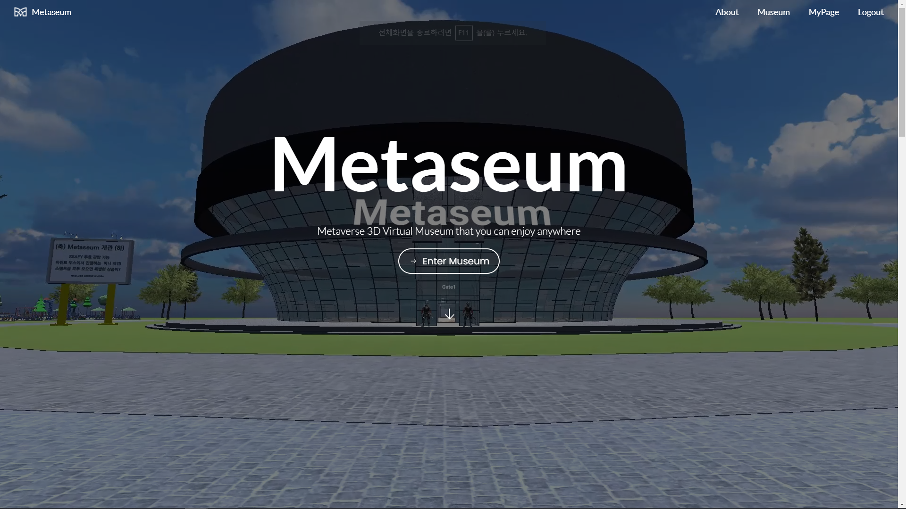

# Metaseum


## 1. 개요

### 한줄 소개

메타버스로 즐기는 문화유산 박물관, Metaseum

### 기획배경

- 문화재청이 700억원을 투자해 보존한 문화유산 3D 모델링의 낮은 활용성
- 국내 박물관 관람객수 감소, 여러 지역에 흩어져있는 문화유산 관람의 어려움
- MZ 세대의 문화유산에 대한 관심, 지식 결여
- K-드라마, K-POP의 인기로 덩달아 관심이 높아진 국내 문화에 대한 관심을 적극 활용

### 타겟

- 메타버스에는 익숙하지만, 문화유산은 잘 모르는 MZ 세대
- 박물관 관람을 원하지만, 시각적 공간적인 제약으로 방문이 어려운 사람들
- 한국의 문화재와 문화유산에 관심이 있는 전세계 모든 사람들

### 목적 및 의의

- 문화재청에서 제공하는 3D 모델을 적극적으로 활용하여, 문화재 홍보에 기여할 수 있다.
- MZ세대의 문화유산 관심을 높이고, 보다 입체적으로 관람하게 돕는다.
- 시간,공간의 제약없이 언제 어디서나 박물관 관람을 가능하게 한다.

### 발표 영상, 서비스 UCC

- 추가 예정


## 2. 주요 기능

### 3D 문화재 관람

- 문화재청에서 제공하는 3D 문화유산을 전시한다.
- 오프라인 박물관보다 더 다양한 각도, 거리에서 볼 수 있다.
- 실제로는 전국 각지 박물관에서 각자 보관하고 있는 문화재를 한 곳에서 쉽게 볼 수 있다.
- 우리 문화유산의 우수성을 세계에 알릴 수 있다.

### 화상채팅

- 기존 조용하고 딱딱한 분위기의 박물관에서 벗어나, 친구들과 자유롭게 소통하며 관람할 수 있다.
- 카메라, 오디오, 스피커는 끄고 켤수 있게 하여 선택적 소통이 가능하다.

### 상호작용

- 문화유산 옆의 설명판을 클릭하면, 더 자세한 설명과 다양한 언어의 음성설명을 들을 수 있다.
- 이벤트 부스에서는 총 3가지의 게임을 제공하며, 게임을 모두 성공 할 경우 칭호를 받는다.
- 문화 유산 스탬프를 찍을 수 있고, 마찬가지로 다 모으면 칭호를 받을 수 있다.
- 이벤트 부스와 무화 유산 스탬프로 문화재에 대한 흥미를 높일 수 있다.


## 3. 세부기능

### 유저 정보 수정

- 마이페이지에서 이름과, 캐릭터, 칭호를 선택할 수 있다.
- 게임 진입시 매번 바꿀 필요 없이, 한번 입력해두면 자동으로 적용된다.

### 방명록

- 박물관 앞에 있는 방명록 보드에는 사람들이 입력한 그림을 전시할 수 있다.
- 최근에 작성된 8개가 보여지고, 추가로 작성할 수 있다.

### 스탬프

- 스탬프로 지정된 5개 문화유산을 모을 수 있다.
- 박물관 우측 하단의 스탬프 모양 버튼을 누르면, 화면이 캡쳐 된다.
- 이미지 속 문화유산이 지정된 문화유산인지 AI가 판단한다.
- 일치하면, 해당 문화유산 스탬프를 모을 수 있고, 모든 스탬프를 모으면 [지화자] 칭호를 받는다.

### 퀴즈

- 박물관 관람에 재미를 더하고, 문화 유산을 좀 더 꼼꼼하게 볼 수 있게 한다.
- 문화재 퀴즈는 주어진 이미지에 맞는 문화재 이름을 맞추는 게임이다.
- OX퀴즈는 주어진 문화재의 설명을 보고, O 또는 X를 선택한다.
- 틀린그림찾기는 두개의 풍속화를 보고 서로 다른 부분을 고르면 된다.
- 모든 문제를 맞출 경우 각각 [좌의정], [영의정], [우의정] 칭호를 받을 수 있다.

### 칭호

- 칭호는 특정 미션을 완료하면 부여하는 것으로 박물관 관람에 재미를 더하는 요소이다.
- 추후에 추가될 기능이나, 맵, 게임을 통해 더 다양한 칭호를 제공할 예정이다.


## 4. 아키텍쳐


## 5. 기술스택

버전 명시

- Unity 2020.3.20f1, webGL, Photon
- React `^17.0.2`
- Kotlin 1.5.0 (JVM 1.8)
- Spring Boot 2.5.4
- Teachable Machine
- Docker 20.10.9
- Docker Compose 3.8
- MongoDB 5.0.3
- openvidu-server 2.20.0
- Jenkins


## 6. 개발환경

- AWS EC2 ubuntu
- S3
- GitLab


## 7. 실행방법

Local 실행 방법

레포 클론 받는다.

### Openvidu docker 실행

```bash
docker run -p 4443:4443 --rm -e OPENVIDU_SECRET=MY_SECRET openvidu/openvidu-server-kms:2.20.0
```

### Back 실행방법

build.gradle에서 webpack 관련 코드 주석 후 실행

```groovy
task webpack(type: NpmTask, dependsOn: 'npmInstall') {
    args = ['run','build']
}

processResources.dependsOn 'webpack'
```

### Front 실행방법

```bash
## /front
$ npm i
$ npm run start
```


## 8. 예시화면



Home


About


MyPage


외부


내부


문화재


자세히보기


틀린그림찾기


OX퀴즈


문화재퀴즈


스탬프 쾅


방명록


## 9. 프로젝트 관리

### Git

#### Branch


#### Commit


#### Issue


#### PR & Code review


### Jira


### Notion


## 10. 팀정보


| 이름 | 역할 | 자세히 |
| --- | --- | --- |
| 박지수 | 팀장, 프론트 | 화면 UI/UX Design, 반응형 화면 구성, Unity 공간 배치, Front req & res Login, PPT 제작, UCC 편집, 발표 |
| 김담영 | 포톤, WebRTC | Unity 멀티플레잉 구현, Unity-Web 통신, WebRTC, 플레이어 상호작용 구현 |
| 강예서 | 포톤, 방명록 | Unity 멀티플레잉 구현, Unity-Web 통신, Teachable Machine 활용 |
| 김준환 | 백 | RestAPI 설계 및 개발, CI/CD |
| 조세연 | 유니티 | Unity 공간배치, 셰이더, Unity-Web 통신 |